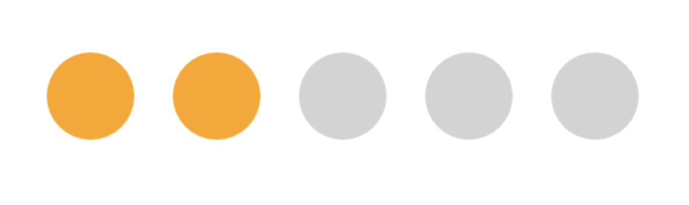
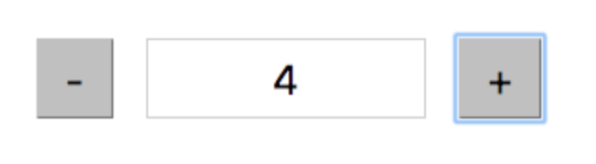
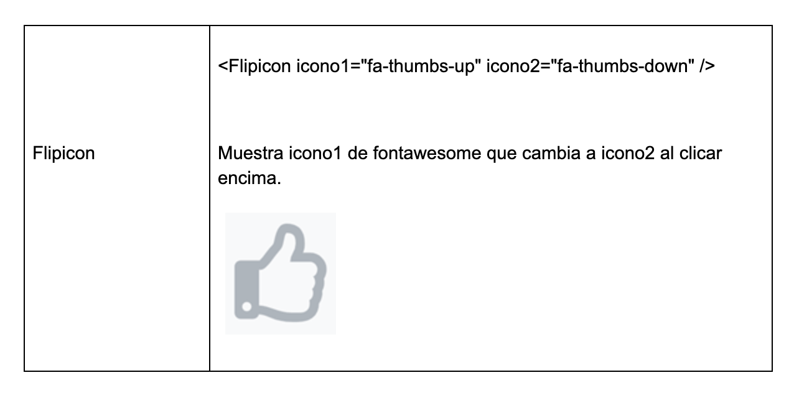

# EJERCICIOS REACT BASICO

## Ejercicio 1: Círculos

Crear varios círculos en pantalla, cuando se clica sobre ellos deben cambiar de color.

Guía:
-   Crear el círculo como un componente (Circulo)
-   Utilizar useState para establecer un estado true/false seleccionado
-   Utilizar el evento onClick del círculo para ejecutar la función que modifica el state.
-   Condicionar el estilo del círculo al valor del state

## Ejercicio 2:
Crear dos botones y un campo <input> como en la figura.
El valor inicial del campo input deberá ser 0.
Al clicar sobre el boton “+” debe sumar una unidad.
Al clicar sobre el boton “-” debe restar una unidad.
Limitar los valores posibles a números enteros de 0 a 10.
Nota: el campo <input> no debe ser editable directamente por el usuario

## Ejercicio 3: Thumbs up/down

Utilizando la librería fontAwesome mostrar un icono que cambie de icon1 a icon2 al pulsar con el ratón.

